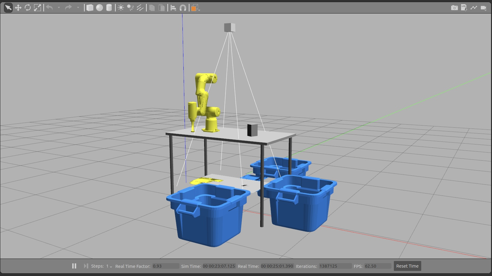

# PastaBot: 
### Force Sensing for Pasta Packaging Automation
<p align="center">
  
</p>


## Table of Contents
1. [Introduction](#introduction)
2. [Installation](#installation)
3. [Index](#index)
3. [Specs](#specs)
4. [Usage](#usage)
5. [Demo](#demo)


## Introduction
The goal of this project is to simulate the use of a collaborative robot in an industrial setting. The robot will handle and sort some boxes, each with standardized packaging but different masses, placing them in the appropriate disposal bin based on their weight. The entire program has been developed in Python using [ROS](https://wiki.ros.org/noetic), with [Gazebo](https://gazebosim.org/home) and [MoveIt](https://github.com/moveit/moveit_tutorials/blob/master/doc/gazebo_simulation/gazebo_simulation.rst) for the simulation component and [OpenCV](https://opencv.org/) for the vision system. 


## Installation
- Sourcing ROS underlay (Noetic distro in this case):
```shell
source /opt/ros/noetic/setup.bash
```

- Cloning repository:
```shell
git clone https://github.com/alessandromonteleone/SmartRoboticsPastaBot.git
```

- Building the workspace:
```shell
cd ./SmartRoboticsPastaBot/
catkin_make
```


## Index
- [SmartRoboticsPastaBot](.)
    - [Documents](./docs/)
        - [Logo](./docs/logo.jpg)
        - [Presentation](./docs/PastaBot.pdf)
    - [Source Files](./src/)
        - [PastaBot Package](./src/pastabot_pkg/)
            - [Config](./src/pastabot_pkg/config)
            - [Deprecated Scripts](./src/pastabot_pkg/deprecated_scripts/)
            - [Launch](./src/pastabot_pkg/launch/)
            - [Mesh](./src/pastabot_pkg/mesh/)
            - [Models](./src/pastabot_pkg/models/)
            - [Scripts](./src/pastabot_pkg/scripts/)
            - [URDF](./src/pastabot_pkg/urdf/)
            - [Worlds](./src/pastabot_pkg/worlds/)
        - [PastaBot MoveIt Package](./src/pastabot_pkg_moveit/)
            - [Config](./src/pastabot_pkg_moveit/config)
            - [Launch](./src/pastabot_pkg_moveit/launch)
    - [Demo](run.sh)


## Specs
Implementation details can be found in the [PDF](./docs/PastaBot.pdf) presentation.


## Demo
For running the simulation, execute this command from the [SmartRoboticsPastaBot](.) folder:
```shell
./run.sh
```
This will open the Gazebo simulation and a new terminal, where the user is prompted via a menu to select which box to create in the virtual environment, following the options provided:
- 1 for Light Box;
- 2 for Medium Box;
- 3 for Heavy Box;
- 0 for Exit.


Once an option is selected the simulation starts and upon completion it returns to the previous menu for the next selection.


## Credits
[@alcompa](https://github.com/alcompa)
[@alessandromonteleone](https://github.com/alessandromonteleone)
